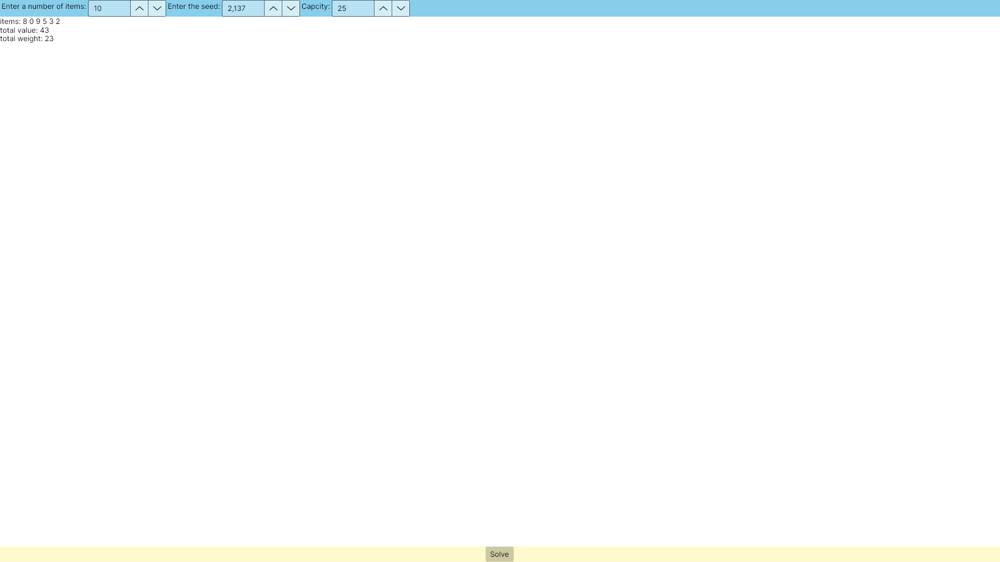

# Laboratorium 1

## Cel laboratrium
Celem laboratorium było stworzenie aplikacji do rozwiązywania problemu plecakowego wraz z interfejsem graficznym.

## Ważne fragmenty kodu

### Klasa `Item`
```c#
internal class Item
{
    public int Id { get; set; }
    public int Value { get; set; }
    public int Weight { get; set; }
}
```

### Klasa `Problem`

```c#
  internal Result Solve(int capacity)
    {
        Array.Sort(items, (a, b) =>
        {
            var RatioA = (double)a.Value / a.Weight;
            var RatioB = (double)b.Value / b.Weight;
            return RatioB.CompareTo(RatioA);
        });
        var C = 0;
        var indecies = new List<int>();
        var totalWeight = 0;
        var totalValue = 0;
        for (var i = 0; i < itemNumber; i++)
        {
            var item = items[i];
            if (totalWeight + item.Weight > capacity) continue;
            indecies.Add(item.Id);
            totalWeight += item.Weight;
            totalValue += item.Value;
        }

        var result = new Result(indecies, totalWeight, totalValue);
        return result;
    }
```

## Zdjęcia programu
