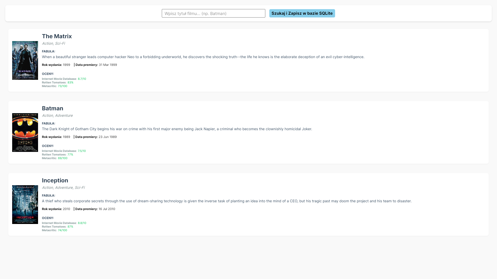

# Laboratorium 2

## Cel laboratorium
Celem laboratorium jest stworzenie aplikacji z wykorzystaniem Entity Framework do połączenia
bazodanowego wraz z interfejsem graficznym

## Ważne elementy programu

### Klasa `API`
```c#
internal class API
{
    public HttpClient client;

    public async Task<Movie> GetData(string movieTitle)
    {
        client = new HttpClient();
        string call = $"http://www.omdbapi.com/?apikey=b59a7244&t={movieTitle}";
        string response = await client.GetStringAsync(call);
      
        Movie movieObj = JsonSerializer.Deserialize<Movie>(response);
      
        return movieObj;
    }
}
```

### Klasa `Movie`

```c#
public class Movie
{
    public int Id { get; set; } 

    [JsonPropertyName("Title")]
    public string title  { get; set; }
    
    [JsonPropertyName("Year")]
    public string year { get; set; } 
    
    [JsonPropertyName("Released")]
    public string release_date { get; set; }
    
    [JsonPropertyName("Plot")]
    public string plot  { get; set; }
    
    [JsonPropertyName("Poster")]
    public string poster  { get; set; }
    
    [JsonPropertyName("Genre")]
    public string genre  { get; set; }
    
    [JsonPropertyName("Ratings")]
    public List<Rating> ratings { get; set; }
    
    public override string ToString()
    {
        return $"Tytuł: {title}, Rok: {year}, Gatunek: {genre}\nFabuła: {plot}";
    }
}
```

### Klasa `Movie Context`
```c#
internal class MovieContext : DbContext
{
    public DbSet<Movie> Movies { get; set; }
    public DbSet<Rating> Ratings { get; set; }

    public MovieContext()
    {
        Database.EnsureCreated();
    }

    protected override void OnConfiguring(DbContextOptionsBuilder options)
    {
        options.UseSqlite(@"Data Source=movies.db");
    }
}
```

### Klasa relacyjna `Rating`
```c#
public class Rating
{
    public int Id { get; set; } // Klucz główny
    
    [JsonPropertyName("Source")]
    public string source { get; set; }
    
    [JsonPropertyName("Value")]
    public string value { get; set; }

    public int MovieId { get; set; }
    [JsonIgnore] 
    public Movie movie { get; set; } 
}

```

## Zdjęcia programu

